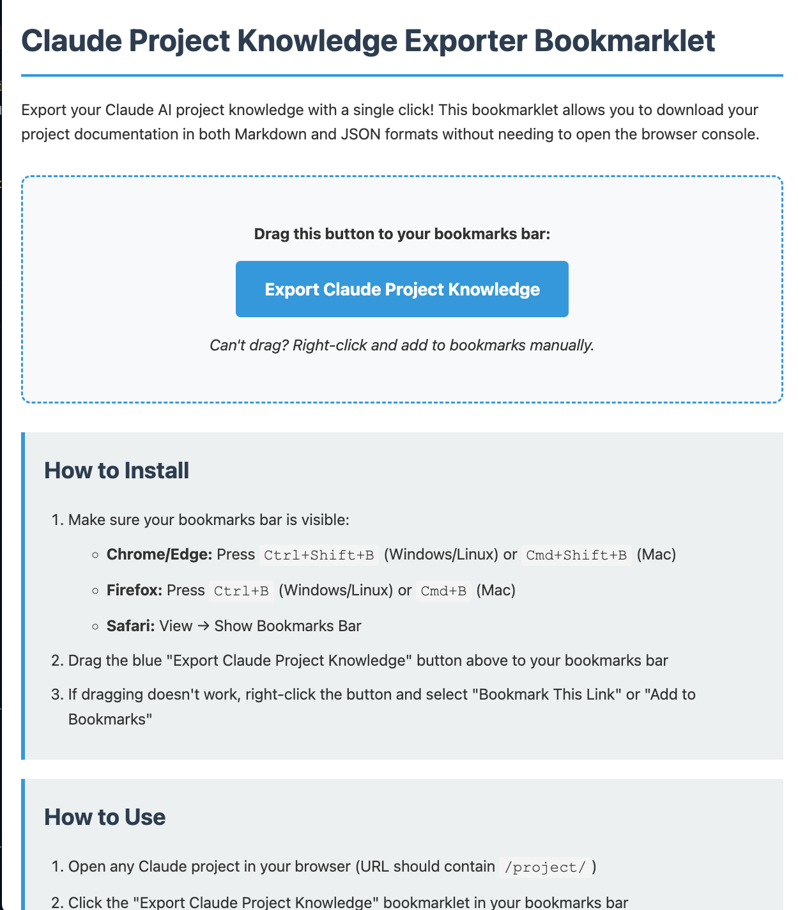

# Claude Project Knowledge Exporter

Export your Claude AI project knowledge documentation as Markdown and JSON files with a single click.

## 🔗 Try It Now

**Live Demo:** https://withlinda.github.io/claude-project-knowledge-exporter/

Visit the link above to install the bookmarklet directly - no download required!

> **Looking to export conversations instead?** Check out [Claude Conversation Exporter](https://github.com/withLinda/claude-conversation-exporter) for exporting individual chat conversations.

## ✨ Features

- 🚀 **One-click export** via bookmarklet - no console needed
- 📦 **Three export modes**: Consolidated, Individual, or Complete
- 🔍 **Automatic project name detection** from page DOM
- 🔒 **100% client-side** - your data never leaves your browser
- 📝 **Preserves original structure** with document names and metadata

## 📥 Installation

### Option 1: Direct Install (Recommended)
1. Visit https://withlinda.github.io/claude-project-knowledge-exporter/
2. Drag the blue "Export Claude Project Knowledge" button to your bookmarks bar
3. That's it! The bookmarklet is now ready to use on any Claude project

### Option 2: Local Install
1. Clone this repository and open `index.html` in your browser
2. Follow the same steps as above

## 🎯 Usage

1. Navigate to any Claude project (URL should contain `/project/`)
2. Click the bookmarklet in your bookmarks bar
3. Choose your export type:

4. Wait for the export to complete:

5. Find your files in the download folder:

## 📊 Export Options

| Option | What You Get | Best For |
|--------|-------------|----------|
| **1 - Consolidated** | Single overview MD + JSON | Quick reference and reading |
| **2 - Individual** | Separate MD for each document + JSON | Preserving original structure |
| **3 - Complete** | Both consolidated + individual files + JSON | Comprehensive backup |

## 🖥️ Console Method (Advanced)

For advanced users who prefer the console:

1. Open project → F12 → Console
2. Paste contents of `claude_project_export_script.js`
3. Press Enter and follow prompts

## 📋 Requirements

- Modern browser (Chrome, Firefox, Edge, Safari)
- Active Claude session
- Project URL containing `/project/`

## 🔒 Privacy & Security

- Runs entirely in your browser
- No external servers involved
- Only accesses the current project
- Files download directly to your computer

## 🔧 Troubleshooting

**No downloads?** Check browser download settings and popup blockers

**Organization ID prompt?** The script will ask for manual input if auto-detection fails

**Wrong filename?** Ensure you're on the project page before running the script

## 🤝 Contributing

Contributions are welcome! To contribute:

1. Fork the repository
2. Create a new branch for your feature
3. Make your changes
4. Test thoroughly in different browsers
5. Submit a pull request

Please keep contributions focused on improving core export functionality.